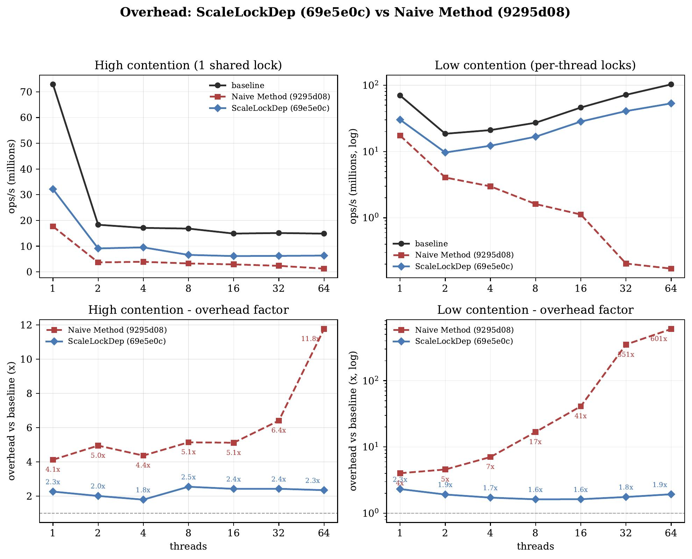
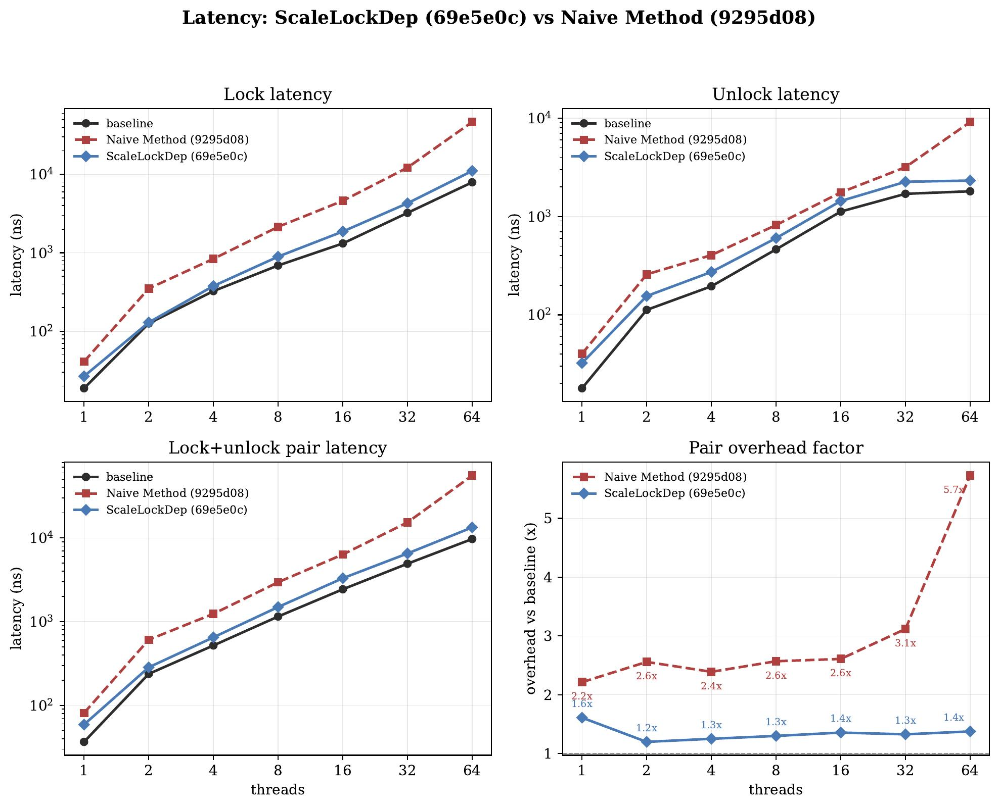
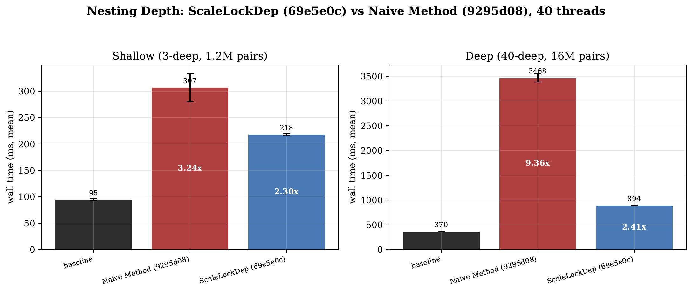
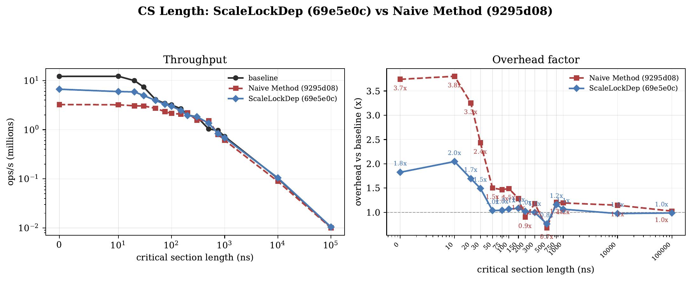

# ScaleLockDep

**ScaleLockDep** is a scalable, transparent, user-space deadlock detector for
multi-threaded C programs. It intercepts `pthread_mutex_*` calls via `LD_PRELOAD`
— **no source changes and no recompilation of your program** — and reports:

- **Potential deadlocks** — circular lock-order dependencies, caught even when no
  deadlock has actually happened yet.
- **Actual deadlocks** — a live circular wait chain, caught the moment a thread is
  about to block forever (exits with code `66` instead of hanging).

---

## 1. Build it

```bash
make build          # builds lockdep/liblockdep.so + the example/benchmark binaries
```

Or just the detector library:

```bash
make -C lockdep     # produces lockdep/liblockdep.so
```

## 2. Run a minimal example

Here is a minimal program with a classic lock-ordering bug. Two threads take the
same two locks in **opposite** orders (`A→B` vs `B→A`). They run one after the
other here, so the program *happens* not to hang — but the lock-order cycle is a
latent deadlock waiting for the wrong interleaving. Save it as `example.c`:

```c
#include <pthread.h>
#include <stdio.h>

static pthread_mutex_t A = PTHREAD_MUTEX_INITIALIZER;
static pthread_mutex_t B = PTHREAD_MUTEX_INITIALIZER;

static void *worker1(void *arg) {
    (void)arg;
    pthread_mutex_lock(&A);
    pthread_mutex_lock(&B);          // order: A -> B
    pthread_mutex_unlock(&B);
    pthread_mutex_unlock(&A);
    return NULL;
}

static void *worker2(void *arg) {
    (void)arg;
    pthread_mutex_lock(&B);
    pthread_mutex_lock(&A);          // order: B -> A  (opposite!)
    pthread_mutex_unlock(&A);
    pthread_mutex_unlock(&B);
    return NULL;
}

int main(void) {
    pthread_t t;
    pthread_create(&t, NULL, worker1, NULL);
    pthread_join(t, NULL);
    pthread_create(&t, NULL, worker2, NULL);
    pthread_join(t, NULL);
    puts("done");
    return 0;
}
```

> This is the same program shipped as [`lockdep/test.c`](lockdep/test.c), so you
> can skip the copy-paste and use that file directly.

Compile it normally (build with `-g` so reports can show source lines):

```bash
gcc -g -pthread -o example example.c
```

**Run it without the detector** — the bug is invisible:

```console
$ ./example
done
```

**Run it under ScaleLockDep** — the latent cycle is reported:

```console
$ LOCKDEP_REPORT_SITES=1 LD_PRELOAD=./lockdep/liblockdep.so ./example
[LOCKDEP] ========================================
[LOCKDEP] POTENTIAL DEADLOCK DETECTED
[LOCKDEP] new dependency: L1(0x...d0a0) -> L0(0x...d060)
[LOCKDEP]   observed by T1(tid=125628) at worker2 at .../example.c:20
[LOCKDEP] existing chain: L0(0x...d060) -> L1(0x...d0a0)
[LOCKDEP]   edge L0(0x...d060) -> L1(0x...d0a0)
[LOCKDEP]     observed by T0(tid=125627) at worker1 at .../example.c:11
[LOCKDEP] cycle: L1(0x...d0a0) -> L0(0x...d060) -> L1(0x...d0a0)
[LOCKDEP] ========================================
done
```

The report names both lock-order edges, the threads that observed them, and the
source line of each acquisition — pointing straight at the two call sites whose
orders disagree. (Addresses and thread IDs vary per run; set
`LOCKDEP_REPORT_SITES=1` and build with `-g` for the `file:line` annotations.)

## 3. Catch a *real* deadlock

If a program would actually hang, ScaleLockDep detects the live wait cycle the
instant it forms and exits `66` instead of deadlocking forever:

```console
$ LD_PRELOAD=./lockdep/liblockdep.so ./benchmarks/deadlock_2thread_2lock.out
[LOCKDEP] ========================================
[LOCKDEP] ACTUAL DEADLOCK DETECTED
[LOCKDEP] wait chain: T1 -> L0(0x...8080) -> T0 -> L1(0x...80c0) -> T1
[LOCKDEP]   T1 waits for L0 held by T0
[LOCKDEP]   T0 waits for L1 held by T1
[LOCKDEP] ========================================
$ echo $?
66
```

**Exit code `66` = deadlock detected. Exit code `0` = clean run.** That makes
ScaleLockDep easy to drop into a test harness or CI gate.

## Run your own program

Any dynamically linked program works the same way — no rebuild required:

```bash
LD_PRELOAD=./lockdep/liblockdep.so ./your_program          # default backend
LOCKDEP_MODE=rb LD_PRELOAD=./lockdep/liblockdep.so ./your_program   # scalable backend
LOCKDEP_DEBUG=1 LD_PRELOAD=./lockdep/liblockdep.so ./your_program   # verbose logging
```

---

## Performance

ScaleLockDep is built to stay cheap as programs scale up in threads and
lock-nesting depth. The figures below compare three conditions on an 11th-gen
Intel Core i7-11700 (8 cores / 16 threads, Linux 7.0):

- **baseline** — no detector,
- **Naive Method** (`9295d08`) — a straightforward synchronous interceptor without
  the scale-branch optimizations,
- **ScaleLockDep** (`69e5e0c`) — this detector, with the lock-free ring-buffer
  backend and hot-path optimizations.

Across every experiment the naive approach degrades sharply with thread count and
nesting depth, while ScaleLockDep keeps overhead roughly **flat**.

### Throughput overhead vs. thread count



Under **high contention** (one shared lock), ScaleLockDep holds a tight
**1.8–2.5×** band from 1 to 64 threads while the naive method climbs to **11.8×**.
Under **low contention** (per-thread locks) the gap is stark: the naive method
hits **601×** at 64 threads (note the log scale) because it serializes every
acquire on a global structure, whereas ScaleLockDep stays near **1.6–1.9×**.

### Per-operation latency



Lock, unlock, and lock+unlock-pair latency tell the same story. The pair overhead
factor (bottom right) shows ScaleLockDep at **~1.2–1.6×** across the sweep while
the naive method blows up to **5.7×** at 64 threads.

### Nesting depth — where the design pays off



Lock-order graph construction scales with nesting depth, so deep nesting is the
hardest case. At **40-deep** nesting (40 threads, 16M lock pairs) the naive method
costs **9.36×** baseline; ScaleLockDep offloads that O(depth) work to a background
worker and costs only **2.41×**. It also wins at shallow 3-deep nesting
(2.30× vs 3.24×).

### Critical-section length — real workloads amortize the cost



When a lock actually protects work (8 threads, one shared lock, hold time swept
0 → 100 µs), the detector's cost is amortized away. By a ~500 ns critical section
both detectors converge to **~1.0×** baseline — and ScaleLockDep dominates the
naive method for the smallest critical sections (1.8× vs 3.7×).

> Raw data and detailed analysis for every experiment live in
> `logs/exp_06_may_*.txt`; vector (PDF) versions of all figures are in `plots/`.

---

## How it works

On every intercepted lock operation, ScaleLockDep does two things in addition to
forwarding to the real pthread call:

1. **Actual-deadlock check (synchronous).** Before a thread blocks on a busy
   mutex, it walks the wait chain
   `current thread → target lock → owner → lock the owner waits on → …`. If the
   chain returns to the current thread, a deadlock is imminent — it reports and
   `_exit(66)`s rather than hang.
2. **Potential-deadlock check (lock-order graph).** When a lock is acquired while
   others are held, it records the dependency edges `held → new` and checks the
   accumulated graph for a cycle — flagging latent bugs even on a clean run.

### Detection modes

The potential-deadlock backend is selectable at runtime with `LOCKDEP_MODE`; the
actual-deadlock detector is always synchronous and exact.

| Mode | `LOCKDEP_MODE` | Behavior |
|------|----------------|----------|
| **Global** (default) | `global` | Synchronous. Each nested acquire adds edges to a global adjacency matrix and runs DFS cycle detection inline under a global spinlock. Simple and exact, but the hot path grows with nesting depth and serializes across threads. |
| **Ring-buffer** | `rb` | Asynchronous. Threads enqueue lock-order events into per-thread lock-free SPSC ring buffers; a background worker owns the graph and cycle detection. The hot path only pays an enqueue, so it stays roughly constant in depth and contends far less — this is what keeps the curves above flat. |

When a ring fills (`rb` mode), `LOCKDEP_RB_FULL` chooses the policy: `stall`
(default, keeps tracking exact) or `drop` (approximate potential-deadlock
reporting; actual-deadlock detection stays exact).

---

## Configuration

### Environment variables

| Variable | Values | Description |
|----------|--------|-------------|
| `LOCKDEP_MODE` | `global` (default), `rb` | Potential-deadlock backend. |
| `LOCKDEP_DEBUG` | `1` | Verbose debug logging to stderr (quiet by default). |
| `LOCKDEP_REPORT_SITES` | `1` | Record lock call sites and resolve them with `addr2line` for `file:line` in reports (off by default; small hot-path cost). |
| `LOCKDEP_RB_FULL` | `stall` (default), `drop` | `rb`-mode ring-full policy. |

### Compile-time limits (`lockdep/lockdep.h`)

| Macro | Default | Meaning |
|-------|---------|---------|
| `LOCKDEP_MAX_LOCK_SLOTS` | `256` | Distinct mutexes tracked. |
| `LOCKDEP_MAX_HELD_LOCK_SLOTS` | `64` | Locks held simultaneously per thread. |
| `LOCKDEP_MAX_THREAD_SLOTS` | `128` | Threads tracked. |
| `LOCKDEP_RB_CAPACITY` | `4096` | Per-thread ring-buffer entries (`rb` mode). |
| `LOCKDEP_TLS_LOCK_CACHE_SIZE` | `64` | Per-thread mutex→slot cache size. |

---

## Testing

```bash
./run_tests.sh
```

Runs **16 test cases** and prints a confusion matrix (accuracy, precision,
recall). A 5-second timeout guards each case: a hang (an actual deadlock that was
not detected) is killed and counted as a deadlock.

| Tests | Category | Expectation |
|-------|----------|-------------|
| 01–06 | Purely non-deadlock (ordered locking, disjoint locks, lock-free) | Clean exit |
| 07–10 | Guaranteed deadlock (2-thread AB/BA, 3-thread circular, self-deadlock, 4-thread cycle) | Detected |
| 11–13 | Dubious / unsafe ordering (random, trylock-retry, dynamic selection) | Timing-dependent |
| 14–16 | Mixed / partial deadlock (subset of threads block) | Detected |

The standalone test programs are documented in [`test/README.md`](test/README.md).

---

## Architecture

The detector lives in `lockdep/` — six C files plus a shared header:

| File | Responsibility |
|------|----------------|
| `hook.c` | `LD_PRELOAD` interposition; fast-path `trylock`; recursive-call guard. |
| `core.c` | Orchestrates acquire / release / before-block; actual-deadlock wait-chain walking. |
| `graph.c` | Global-mode backend: adjacency matrix + DFS cycle detection with predecessor-bit pruning. |
| `potential.c` | Backend selection; `rb` worker thread, per-thread SPSC queues, async graph maintenance. |
| `state.c` | Lock/thread slot registries; per-thread TLS held-lock stack; TLS mutex→slot cache. |
| `log.c` | Formats debug logs and deadlock reports. |

Hot-path optimizations include a per-thread TLS lock-slot cache, fast paths for
top-level acquire/release, predecessor summaries that skip repeated edges, O(1)
LIFO held-stack pops, and `-flto -fno-semantic-interposition` for cross-unit
inlining. See [`lockdep/README.md`](lockdep/README.md) for details.

---

## Reproducing the benchmarks

```bash
make run               # correctness / deadlock benchmarks under lockdep
make overhead          # throughput sweep: 1..64 threads, high + low contention
make overhead-cslen    # vary critical-section hold time (0–100000 ns)
make latency           # per-operation lock/unlock latency sweep
make potential-edges   # potential-graph construction cost (disjoint locks)
make overhead-anylock  # any-of-N-locks acquire overhead sweep
```

End-to-end (writes `logs/exp_*_*.txt` and `plots/exp_*_*.pdf`):

```bash
scripts/reproduce_all.sh [SUFFIX]   # SUFFIX defaults to DD_mon, e.g. 06_may
```

Plotting scripts require `matplotlib` (run with `uv run`):

```bash
uv run scripts/plot_overhead.py logs/exp_06_may_overhead.txt
uv run scripts/plot_latency.py  logs/exp_06_may_latency.txt
```

---

## Project report

This project was built for **CS533** (Parallel Computer Architecture),
instructed by **Prof. Josep Torrellas**, at the University of Illinois
Urbana-Champaign. The full write-up — design, algorithms, and the complete
evaluation — is in the repository:

- [`cs533_final.pdf`](cs533_final.pdf) — *"ScaleLockDep: Scalable and Transparent
  User-space Deadlock Detector"*, Peizhe Liu, Hieu Nguyen, Lei Huang.

## Branch structure

- **`main`** — stable branch with the original synchronous global-mode detector.
- **`scale`** — performance branch (this one) adding the ring-buffer (`rb`)
  backend, per-thread SPSC queues, predecessor summaries, fast paths, and TLS
  caching.
</content>
